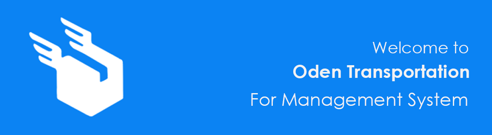

# Oden Transportation Management System

Introducing Oden-Transportation Management System, a dynamic Java-based application engineered to revolutionize the way transportation agencies manage their operations. With its innovative approach, Oden-Transportation not only streamlines package and client management but also provides tailored user accounts for each agency user, fostering enhanced collaboration and efficiency.

At the heart of Oden-Transportation is its robust account management system, which grants each agency user personalized access to the platform's suite of features. From package and client information management to pricing calculations and beyond, users can seamlessly navigate the application to fulfill their specific responsibilities and tasks.

By providing individualized accounts, Oden-Transportation promotes accountability and transparency within agencies, enabling precise tracking of user actions and updates. This granular level of control ensures that each user can focus on their designated tasks, ultimately driving productivity and optimizing workflow efficiency.

With Oden-Transportation, transportation agencies can empower their teams with the tools they need to thrive in today's competitive landscape. Experience the future of logistics management with Oden-Transportation Management System — where personalized user accounts meet unparalleled performance
